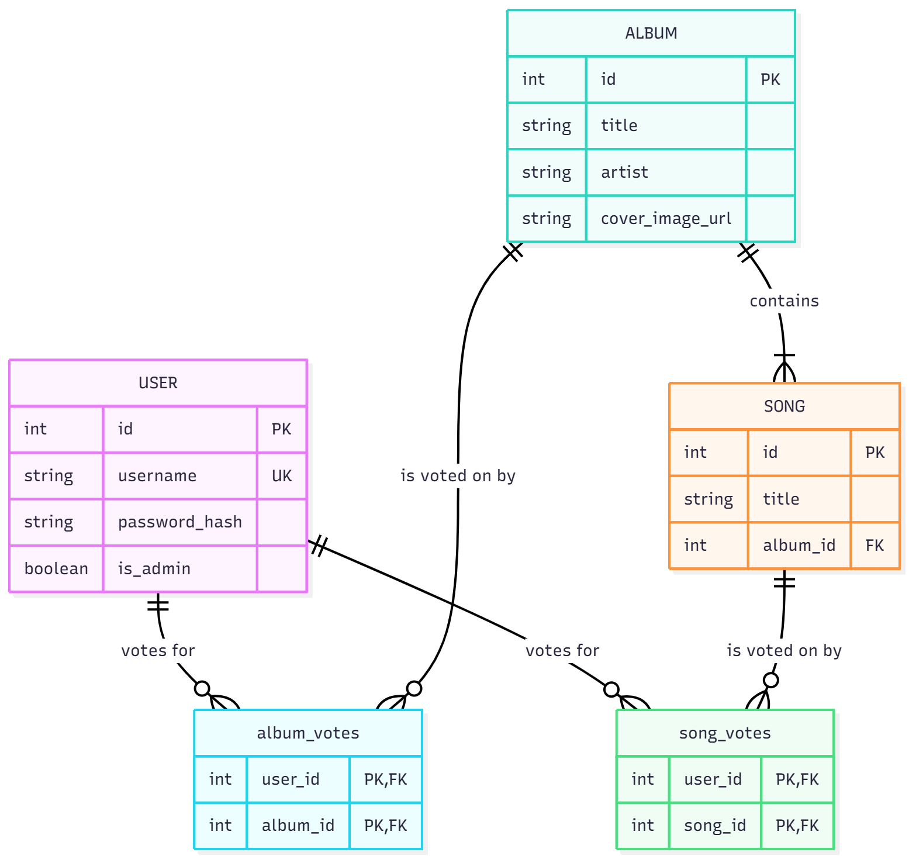

# Database Systems

> Course assignments and projects on databases and Python web app development (SQL/NoSQL, indexing/transactions, ORMs, REST APIs, and frontend integration).

1141 資料庫系統

授課教師：蔡芸琤老師

<!--


 -->

- [Database Systems](#database-systems)
  - [HW1: The To-Do app](#hw1-the-to-do-app)
  - [HW2: Music Vote (With ERD)](#hw2-music-vote-with-erd)
  - [HW3: The Joke App](#hw3-the-joke-app)
  - [HW4: The Joke App+](#hw4-the-joke-app)

## HW1: The To-Do app


- Code: [/HW1](./HW1)
- Explanation: [https://youtu.be/n_HeP-MRVVA](https://youtu.be/n_HeP-MRVVA)


👉 **How to run the app**

```bash
pip install -r requirements.txt
python app.py
```

## HW2: Music Vote (With ERD)


- Code: [/HW2/music-voting-app](./HW2/music-voting-app)
- Explanation: [https://youtu.be/33NsqejpkMA](https://youtu.be/33NsqejpkMA)




*🔼 This ERD (Entity-Relationship Diagram) illustrates how the different tables are connected and how data flows within the application.*

👉 **How to run the app**

Frontend
```bash
npm i
npm run dev
```

Backend
```bash
cd backend
pip install -r requirements.txt
python run.py
```

## HW3: The Joke App


- Code: [/HW3/joke-app](./HW3/joke-app)
- Explanation: [https://youtu.be/rC0nTsmWGuE](https://youtu.be/rC0nTsmWGuE)
- Online demo: [https://jokeapp.sk5s.org](https://jokeapp.sk5s.org)


👉 **How to run the app**

```bash
pip install -r requirements.txt
python app.py
```

## HW4: The Joke App+


- Code: [/HW4/joke-app](./HW4/joke-app)
- Explanation: []()
- Online demo: [https://jokeapp.sk5s.org](https://jokeapp.sk5s.org)

👉 **How to run the app**

```bash
pip install -r requirements.txt
python app.py
```
